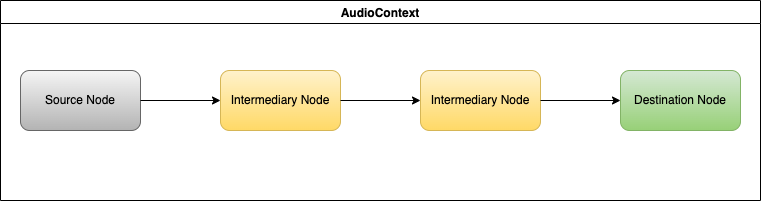

# Web Audio

Web Audio API PoC using [AudioWorklet](https://www.w3.org/TR/webaudio/#audioworklet) feature.

This project is implemented for Medium article [Playing PCM data using WebAudio API](https://medium.com/@selcuk.sert/playing-pcm-data-using-webaudio-api-949558576646).

## Audio Graph




## Generator Service

To start generator service invoke following:

```shell
node ./generator/main.js
```

##  Streamer Service

To start streamer service invoke following:

```shell
node ./streamer/main.js
```

##  Audio Player

For details on player Web app please refer to the [documentation](./client/README.md).
